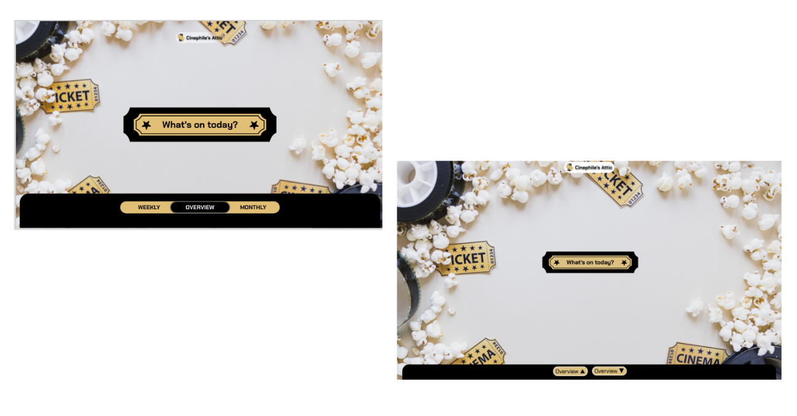
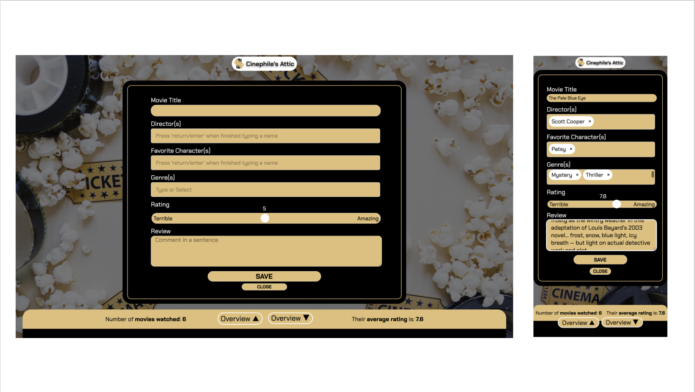
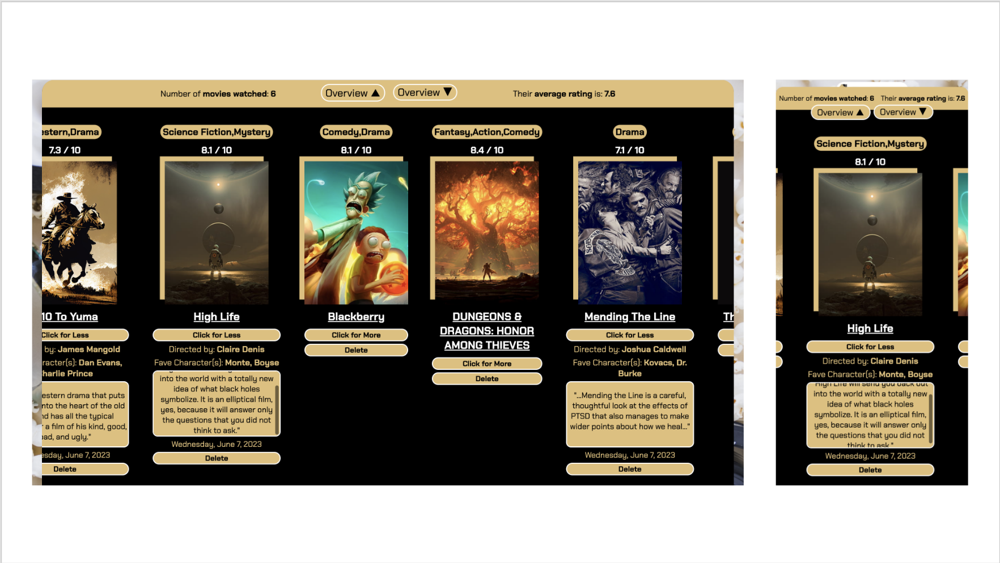

# Development Documentation
## Home page

Desktop(Left) and Mobile(right)
### Development process
1. Implemented CSS grid to create a layout for the home page, also embeded logo, button, and background images and adjusted their appearance and position.
2. Placed various elements into designated grid areas and incorporated a pop-up form and hover effect for the "what's on today" button.
3. Added a slide up and down transition for the overview section located at the bottom of the page.
### Iterations
* The overview section was originally placed at the bottom of the home page and could only be seen by scrolling down. However, to make it more user-friendly and convenient, a slide up/down transition was added so that users no longer have to scroll the page.
### Improvements
* To make it clear for users whether they have activated the button or not, hover/click transitions were added to highlight the ongoing interaction.
* To improve user experience, a hover effect was added to the "What's on Today" button to indicate its interactivity. This effect expands the button when the user's cursor hovers over it, making it more visible on big (desktop) screens.
### Lessons learned & Best practices
* I originally intended to place the overview section above the homepage when the former expands. However, the grid layout used on the homepage caused it to be pushed to the side by the overview section. I tried to make them overlap by applying z-index to both sections, but this didn't work. I then learned from html reference page that z-index only works on elements that have a position setting, so I applied this to all sections, which messed up the placement of elements. After several attempts, I used relative and absolute positioning and flexbox to fix it.
* I have attempted various methods to avoid the Overview section from overflowing the screen. This issue caused the webpage to duplicate and expand multiple times, leaving a significant amount of unused blank space. I even tried to remove the grid template but it didn’t make any difference, I searched online and find that this can be solved by simply setting the ‘overflow’ property to hidden. I’ve learned that it is more effective to check reference documents when trying to solve problems, rather than making uninformed assumptions.

## User input form

Desktop(Left) and Mobile(right)
### Development process
1. Added form structure and set up different input fields, also adjusted the appearance and position of the form area.
2. Modified the layout and implemented desired functions to multiple input, range and textarea form areas, added submit and close buttons to the form.
3. Added JS code to track and store user input after the submit button is pressed.
### Iterations
#### Iteration 1:
For easier data manipulation and better user experience, input fields that accept multiple entries (directors and favorite characters) were switched from simple text input to multiple tags input. This allows for all values to be stored independently in an array, and users can easily add or remove entries as needed.
#### Iteration 2:
Genre selection fields were switched from a dropdown list to a tag selection field, which displays all available options in an intuitive and straightforward manner. Additionally, users can also type in their desired genre and receive recommendations.
#### Iteration 3:
A close button has been incorporated into the form enabling users to close the form without submitting it. This feature enhances user control and freedom as it provides a way to leave the unwanted state (filling the form) without consequences.
### Improvements
* Keep users informed by adding a focus state to input fields, which outlines the active (selected) form row and increases font size, which also enhances the readability and accessibility of the form.
* For mobile devices, all multiple input fields is set to be scrollable and self-contained, so that tags don't flow out of the input field and block other fields.
* To prevent false triggering on a small screen, increased vertical space between buttons and between form fields, also adjusted the size of submit and close buttons. 
### Lessons learned & Best practices
* I attempted to use a GitHub library to create a dropdown list that allows for multiple genre selections, but its documentation is vague and incomplete, without any explanations on how it works and the output it produces. Consequently, I couldn’t retrieve all of the selected options to be used in JS functions. I then switched to the recommended tagify library, which gives clear and detailed instructions throughout, and I was able to track and utilize all the selected options. Through this experience, I have come to understand the significance of utilizing a thoroughly documented library and the benefits of keeping track of the development process.
* After clicking the close button instead of the save (submit) button, I noticed multiple error messages in the console indicating that all the required form input controls were not focusable. To resolve this issue, I researched online and discovered that adding type='button' to the close button enables it to close the form without submitting it and bypasses the browser's validation, thereby avoiding the error.
## Overview

Desktop(Left) and Mobile(right)
### Development process
1. Set up the layout with slide up/down buttons and a film list, adjusted their appearance and position.
2. Added code to display and interact with the filmlist, including functionality for the click for more/less, and delete buttons.
3. Added code to calculate and update media consumption statistics, also added a section to display the result at the top of the overview page.
### Iterations
#### Iteration 1:
Based on the feedback from the tutor, I refined the scope and design of the overview section by simplifying it into one page with some statistics rather than breaking it into three different pages.
#### Iteration 2:
As suggested by the tutor, I added different user states other than simply viewing the film list. One of them is click to see all details of a tracked film, and the other is click to delete a tracked film.
#### Iteration 3:
To enhance readability of the text content, I increased the font size and set up scrollable text box for the review section. Each film entry also expands when the click for more botton is clicked.
### Improvements
* For a more intuitive and effortless user experience, I highlighted all interactable elements of a list item with white borders, so they can be spotted by the user right away.
* Added click and drag scrolling for touch-screen-based devices, users can either scroll or drag the film list as they needed. 
### Lessons learned & Best practices
* I attempted to utilize the IMDb API to locate the exact movie poster for the thumbnail image. However, it appears that all the available APIs require payment for permission to use. Thus, I chose to use preset images based on film genres instead.
* I attempted to use glide.js to build an image carousel for user inputs, but it turned out to be incompatible with the software stack my prototype is using. As a result, my app was not functioning properly and a lot of errors were appearing in the console. However, I was able to resolve this issue by switching to splide.js, a similar library that works perfectly with my code. I realized that it's important to be flexible and open to different approaches when one method is not effective, or you’ll just end up wasting more time.
* I encountered a lot of problems trying to create an carousel with the Splide.js library. The main issue was that in my case, the target items are meant to be added by the user in real-time, instead of being set beforehand (as is typical for applying an carousel). Consequently, I need to reload the page whenever a new item is added to make sure the DOM centent has been loaded and reconstruct the Splide carousel based on the new input. I also can't use the loop mode as it prevents items being properly deleted. The library is set to retain a copy of the minimum amount of items required to create a loop, and continues to display them even after deletion. These restrictions make it impossible for me to create a single page architecture that requires no page reload. Hence, I opted to construct a simple list presentation instead.
* To add media consumption statistics to the page, I used the appendchild() method but ended up with multiple output because the calculation happens inside loops. I then switched it to the replacechild() method, this did create single output but is not reusable since the node get replaced after one loop, and the same node identifier can't be used for the next loop. I then realized that I can simply set the content of the statistic field with innerhtml, so that the stats get refresed and displayed correctly.
## Application Configuration:
### Screen dimensions and resolutions best for viewing the application
**Dimensions** 
* Desktop (width x depth): viewport size: 1440 x 821px (Google Chrome)
* Mobile (width x depth): viewport size 390 x 821px (Google Chrome)
**Resolutions**: 2560 x 1600 pixels
### Steps required to interact with the application
1. Refresh the page if ever switched between desktop view to mobile view with transformed overview section, as the transition triggered by slide up/down feature is different for different screen size.

## Deployment Procedures:

To start the server:
```
npm run start
```

## Guidance for future developers:
### Architecture and Technology Stack:
* The current application (Cinephile's Attic) is built using a single page application (SPA) architecture. This approach allows for a seamless user experience by dynamically updating content without page reloads. This application is responsive for both mobile and desktop devices.
* The technology stack includes HTML, CSS, and JavaScript for the front-end, along with a backend code for a minimal web server. This application implement local storage for keeping track of data in users' browsers, and persistent access between sessions.
### General Purpose of Cinephile's Attic:
* Allowing users to create a personalized watchlist of movies they’ve watched, which includes viewing history, film ratings and reviews.
* Giving users the ability to rate and review movies they've watched.
* Keeping track of the user's favorite characters of a movie, and other basic information of the movie, e.g. director(s) and genres.
### User Interface (UI):
The existing UI design, layout, and user flow allow users to add, view, and delete film consumption records with a user-friendly interface. It consists of 3 main sections: home page, where users get to access the input form and overview section; input form, where users get to add a film entry; overview section, keep track of all the user entries and where to delete an entry. 
### Recommendations for further improvements or extensions:
#### User Interface (UI):
Consider enhancing the UI with modern frameworks (e.g., React, Angular, Vue.js) to improve code organization, reusability, and performance.
#### User Authentication and Authorization:
Consider implementing authentication options such as social media login (e.g., Facebook, Google) to provide users with login methods and information security measures.
#### Movie Database Integration:
Explore APIs provided by popular movie databases (e.g., IMDb, TMDb) and consider integrating them to enhance the movie data available to users.
#### Tracking and Recording:
Consider implementing a recommendation engine that suggests personalized movie recommendations based on a user's viewing history and preferences.
#### Performance Optimization:
Implement lazy loading techniques to improve initial page load times, especially when dealing with large datasets or media content.
#### Mobile Responsiveness:
Consider building native mobile apps (iOS and Android) using frameworks like React Native or Flutter to provide a dedicated mobile experience.
#### Data Analytics and Insights:
* Explore opportunities to leverage user data to provide valuable insights. Consider implementing analytics tools to track user engagement, popular movies, user preferences, and other relevant metrics.
* Provide visualizations and statistics that allow users to track their movie consumption patterns, genres they prefer, etc.
#### Social Features and Community:
* Consider adding social features that allow users to connect, follow each other, and share their movie habits or recommendations.
* Implement features like comments, likes, and user reviews to facilitate user interactions and build an engaged community.
## References
CODEPEN. (n.d.). *Javascript slideUp slideDown Animation*.
https://codepen.io/NoName84/pen/aNbyyz

Daniel, L. (n.d.). *Horizontal Click and Drag Scrolling with JS*.
https://codepen.io/thenutz/pen/VwYeYEE

Ellis, D. (2022). *How to create a Range Slide in HTML + CSS*.
https://blog.hubspot.com/website/html-slider

W3 Schools. (2023). *W3Schools How To -- Popup Form*.
https://www.w3schools.com/howto/howto_js_popup_form.asp

W3 Schools. (2023). *How TO - Read More Read Less Button*.
https://www.w3schools.com/howto/howto_js_read_more.asp

Yair Even Or. (2023). tagify [JS Library]. 
https://github.com/yairEO/tagify

## Assets
Freepik. (n.d.). *Layout of popcorn with cinema objects* [image]. Freepik. 
https://www.freepik.com/free-photo/layout-popcorn-with-cinema-objects_2317675.htm#query=movie&position=19&from_view=search&track=robertav1_2_sidr 

Gamer Land. (n.d.). *Mafia 2 Definitive Edition 4k* [image]. Pinterest. 
https://www.pinterest.com.au/pin/446560119306578111/ 

bitchlocks. (2016). Bates Motel [Image]. Tumblr.
https://www.tumblr.com/bitchlocks/149530794684/bates-motel-lockscreens-like-or-reblog-if

Peakpx. (n.d.). Get out [image]. Peakpx.
https://www.peakpx.com/en/hd-wallpaper-desktop-pvtpa 

Tunstall, T. (2021). American Underdog [Image]. IrishFilmCritic.
https://www.irishfilmcritic.com/movie-review-true-life-story-celebrates-kurt-warners-improbable-rise-to-greatness-in-american-underdog/ 

Wallpapers-Clan. (2023). Cowboy Brown Art Wallpapers [Image]. Wallpapers-Clan.
https://wallpapers-clan.com/wallpapers/cowboy-brown-art/ 

WallpaperFlare. (n.d.). *HD wzllpaper: Dunkirk* [image]. Wallpaper Flare.
https://www.wallpaperflare.com/action-drama-2017-4k-dunkirk-christopher-nolan-history-wallpaper-qrryk

WallpaperFlare. (n.d.). *HD wzllpaper: anarchy* [image]. Wallpaper Flare.
https://www.wallpaperflare.com/anarchy-biker-crime-drama-series-sons-thriller-wallpaper-bhckc

WallpaperFlare. (n.d.). *HD wzllpaper: action, adventure* [image]. Wallpaper Flare.
https://www.wallpaperflare.com/action-adventure-drama-film-helicopter-movie-poster-rambo-wallpaper-moekn

WallpaperFlare. (n.d.). *HD wzllpaper: fantasy, science fiction* [image]. Wallpaper Flare.
https://www.wallpaperflare.com/fantasy-science-fiction-mountains-sci-fi-planets-digital-art-wallpaper-bldeg

WallpaperFlare. (n.d.). *HD wzllpaper: silhouette* [image]. Wallpaper Flare.
https://www.wallpaperflare.com/silhouette-of-person-standing-in-front-of-tree-wallpaper-game-animation-illustration-wallpaper-hib

WallpaperFlare. (n.d.). *HD wzllpaper: Rick and Morty* [image]. Wallpaper Flare.
https://www.wallpaperflare.com/rick-and-morty-fan-art-rick-and-morty-digital-wallpaper-cartoons-wallpaper-poaoz

WallpaperFlare. (n.d.). *HD wzllpaper: hacker* [image]. Wallpaper Flare.
https://www.wallpaperflare.com/1920x1080-px-anarchy-computer-hacker-hacking-internet-wallpaper-sthpq

WallpaperFlare. (n.d.). *HD wzllpaper: comedy* [image]. Wallpaper Flare.
https://www.wallpaperflare.com/comedy-how-i-met-your-mother-series-sitcom-television-wallpaper-mkdiq

